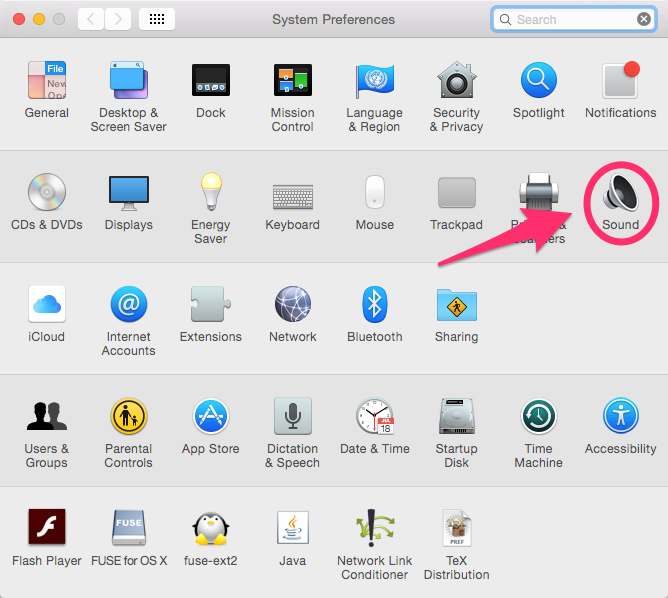
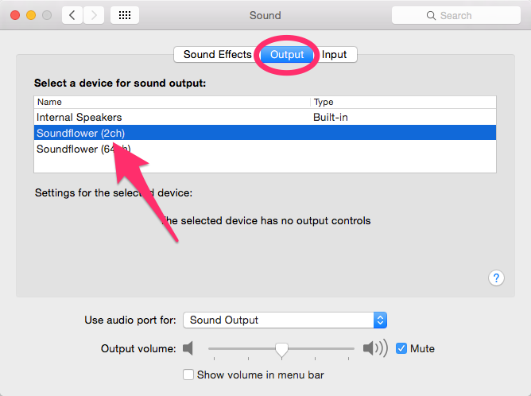

audio.peergrade.th
==================
A small install-and-run script for stream audio from OS X to an LG TV over UPnP.

The script first installs:

* Soundflower
* Icecast
* Darkice (compiled with CoreAudio support)
* Mediatomb

Then it runs all the things, except Soundflower.
To get Soundflower to work its magic go to _System Preferences > Sound_, and then
under the _Output_ pane, choose _Soundflower 2ch_ as your output.

Your speakers should now stop playing -- don't worry! That is all part of the plan.
They'll come back on when you set your output back to _Internal Speakers_.
But for now, leave it on _Soundflower (2ch)_.

Having done that -- you're ready to go. All you need to do now is find your stream on the TV.

Tried and tested solutions
--------------------------

### MediaTomb

Works.
For the LG TV you need to set at least the following custom header:

    <!-- LG TV support: MP3-only -->
    <custom-http-headers>
      <add header="contentFeatures: DLNA.ORG_PN=MP3"/>
    </custom-http-headers>

(See: http://forum.serviio.org/viewtopic.php?f=12&t=5558)

References:
* http://playon.unixstorm.org/mediatomb.php
* http://weblambdazero.blogspot.com/2012/07/streaming-internet-radio-from-raspberry.html
* https://github.com/nikdoof/mediatomb-config/blob/master/mediatomb/config.xml
* http://mediatomb.cc/pages/userinterface
* http://ubuntuforums.org/archive/index.php/t-1198689.html
* http://ubuntuforums.org/showthread.php?t=1626480
* http://ubuntuforums.org/showthread.php?t=1461514
* https://sourceforge.net/p/mediatomb/discussion/440751/thread/33836ce5/

### Serviio

Works.

### HTML5 audio streaming

Doesn't work with LG TV (it won't play steaming MP3 files)

References:
* https://forum.videolan.org/viewtopic.php?t=125710
* http://stackoverflow.com/questions/16978301/html5-audio-livestreaming
